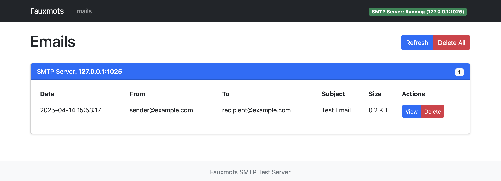
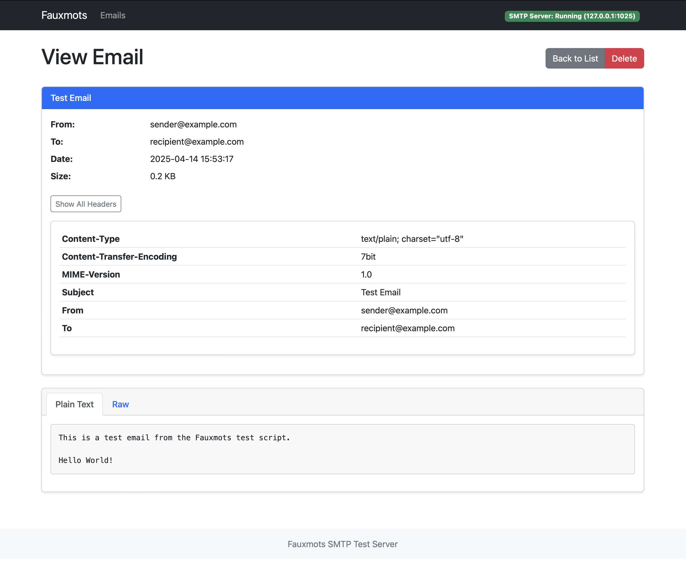

# Fauxmots SMTP Test Server


<p align="center">
  
</p>

Fauxmots is a simple SMTP test server designed for developers to verify outgoing emails from other projects. It captures all incoming emails, stores them, and provides a clean web interface to review and manage them.

## Features

- Built with Python, Flask, HTMX, and SQLite
- Simple SMTP server that accepts all incoming emails
- Web interface to view and manage captured emails
- Displays all email headers and content (HTML, plain text)
- Shows email attachments information
- Real-time updates using HTMX
- Stores raw email files for inspection

## Screenshots




## Requirements

- Python 3.7 or higher
- Dependencies listed in `requirements.txt`

## Installation

1. Clone the repository:
   ```
   git clone https://github.com/patrickomatik/fauxmots.git
   cd fauxmots
   ```

2. Create a virtual environment:
   ```
   python -m venv venv
   source venv/bin/activate  # On Windows: venv\Scripts\activate
   ```

3. Install dependencies:
   ```
   pip install -r requirements.txt
   ```

## Usage

### Running the server

```
python run.py
```

This will start:
- The web server on http://127.0.0.1:5000
- The SMTP server on 127.0.0.1:1025

### Command line arguments

```
python run.py --help
```

Available options:
- `--host`: Host to run the web server on (default: 127.0.0.1)
- `--port`: Port for the web server (default: 5000)
- `--smtp-host`: Host for the SMTP server (default: 127.0.0.1)
- `--smtp-port`: Port for the SMTP server (default: 1025)
- `--debug`: Run in debug mode
- `--no-smtp`: Do not start SMTP server

### Configure your application

Configure your application's SMTP settings to use:
- Host: 127.0.0.1 (or the configured SMTP host)
- Port: 1025 (or the configured SMTP port)
- No authentication required
- TLS/SSL are not required

### Testing

To run the tests:
```
python -m pytest
```

## Project Structure

```
fauxmots/
├── app/                  # Application package
│   ├── __init__.py       # App factory and configuration
│   ├── models.py         # Database models
│   ├── routes.py         # Web routes
│   ├── smtp_server.py    # SMTP server implementation
│   ├── email_parser.py   # Email parsing utilities
│   ├── static/           # Static files (CSS, JS)
│   └── templates/        # HTML templates
├── emails/               # Directory for stored emails
├── tests/                # Test modules
├── run.py                # Application runner
├── wsgi.py               # WSGI entry point
└── requirements.txt      # Dependencies
```

## Contributing

Contributions are welcome! Please see [CONTRIBUTING.md](CONTRIBUTING.md) for details on how to contribute to this project.

## Security Notice

This SMTP server is designed for development and testing purposes only. It accepts all incoming emails without validation and should never be exposed to the public internet.

## License

[MIT](LICENSE)
